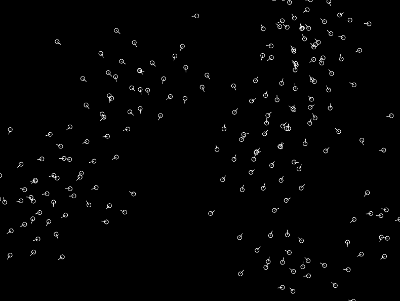

# Flock

An entity component system (ECS) created with TypeScript in mind.

## Install

`npm install flock-ecs`

`import * as flock from 'flock-ecs';`

## Examples

### Boids

Run with:

`yarn workspace boids start`

## Development

This uses Yarn workspaces, so make sure you're using yarn instead of npm.

To build the library in watch mode:

`yarn workspace flock-ecs dev`

And then in another terminal:

`yarn workspace boids start`

## Documentation

TBA
